# Receptury

Receptury (ang. *recipes*) umożliwiają tworzenie przedmiotów lub bloków za pomocą pola konstruowania w rozmiarze 2×2 w ekwipunku, w stole rzemieślniczym (ang. *Crafting Table*), w którym pole konstruowania jest w rozmiarze 3×3 i w kilku innych blokach.

Nasz serwer posiada dodatkowe receptury, aby umożliwić graczom wytwarzanie przedmiotów lub bloków, które nie występują naturalnie na serwerze.

## Bruk

**Bruk** (ang. *cobblestone*) możemy wytworzyć z 8 bloków [czernitu](#czernit) i wiadra wody.

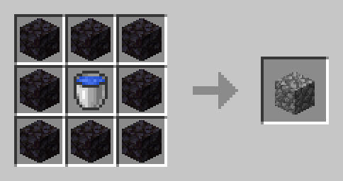

## Czernit

**Czernit** (ang. *blackstone*) możemy wytworzyć z 8 bloków [bruku](#bruk) i czarnego barwnika.

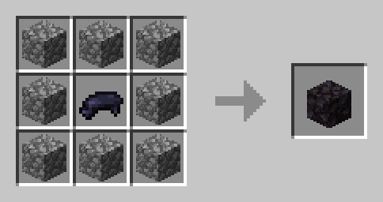

## Czerwony barwnik

**Czerwony barwnik** (ang. *red dye*) możemy wytworzyć z redstone'a. Ułożenie nie ma znaczenia.

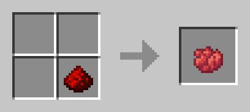

## Dzwon

**Dzwon** (ang. *bell*) możemy wytworzyć z 3 patyków, 5 sztabek złota oraz drewnianego guzika (dowolny rodzaj drewna).

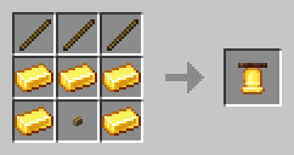

## Jasnopył

**Jasnopył** (ang. *glowstone dust*) możemy wytworzyć ze słonecznika i torbieli ze świecącym atramentem. Ułożenie nie ma znaczenia.

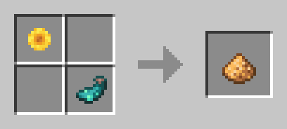

## Kwarc

**Kwarc** (ang. *quartz*) możemy wytworzyć przepalając kamień **na ognisku** .

## Luneta

**Luneta** (ang. *Spyglass*) możemy wytworzyć z (bezbarwnej) szyby oraz 2 sztabek miedzi.

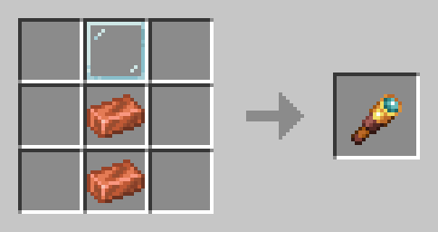

## Łza ghasta

**Łza ghasta** (ang. *ghast tear*) możemy wytworzyć ze [spaczonego grzyba](#spaczony-grzyb-oraz-szkarłatny-grzyb) i wiadra wody. Ułożenie nie ma znaczenia.

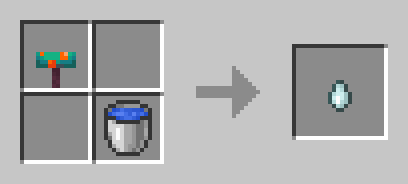

## Netherrack

**Netherrack** możemy wytworzyć przepalając ziemię **w piecu lub piecu hutniczym** (szybciej).

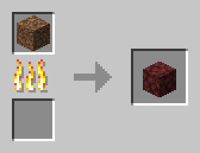

## Odłamek netherytu

**Odłamek netherytu** (ang. *netherite scrap*) możemy wytworzyć z 4 króliczych łapek, [4 łez ghasta](#łza-ghasta) oraz bloku diamentu.

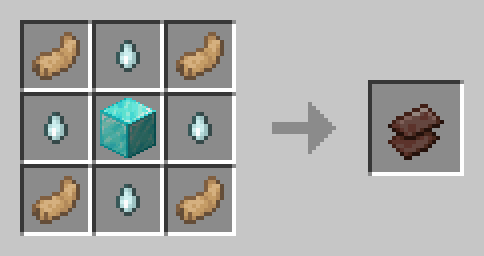

## Piasek dusz

**Piasek dusz** (ang. *Soul Sand*) możemy wytworzyć z piasku oraz [łzy ghasta](#łza-ghasta). Ułożenie nie ma znaczenia.

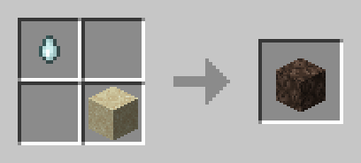

## Spaczony grzyb oraz szkarłatny grzyb

**Spaczonego grzyba** (ang. *Warped fungus*) możemy wytworzyć z brązowego grzyba oraz oka pająka.

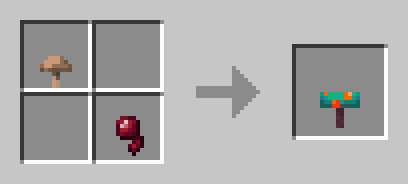

**Szkarłatnego grzyba** (ang. *Crimson fungus*) możemy wytworzyć z muchomora oraz oka pająka.

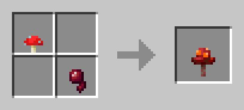

W obydwu przypadkach ułożenie nie ma znaczenia.

## Spaczony trzon oraz szkarłatny trzon

**Spaczony trzon** (ang. *Warped stem*) możemy wytworzyć ze [spaczonego grzyba](#spaczony-grzyb-oraz-szkarłatny-grzyb) oraz pnia drzewa (dowolnego rodzaju).

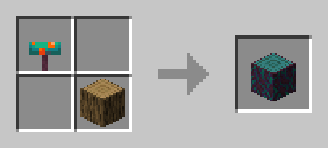

**Szkarłatny trzon** (ang. *Crimson stem*) możemy wytworzyć ze [szkarłatnego grzyba](#spaczony-grzyb-oraz-szkarłatny-grzyb) oraz pnia drzewa (dowolnego rodzaju).

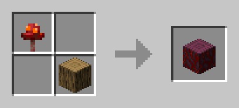

W obydwu przypadkach ułożenie nie ma znaczenia.


